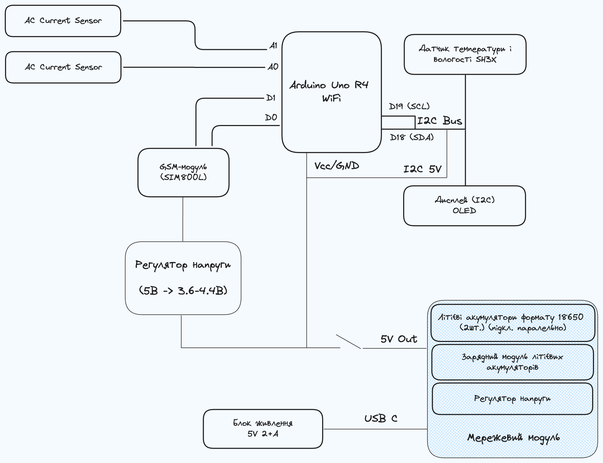

# Energy Status

## Overview

This project is created in order to solve multiple problems:

1. Understand the environment information (temperature and humidity) of where this is status is placed
2. Understand which power sources (1 and 2) have AC power now
3. Send all this information to remote server for understanding of situation
4. Work whether there is WiFi or not and whether there is AC power available or not

## Use cases

1. House with generator
2. House with additional power source (solar panels, battery, etc.)
3. Server rack with reserve power

## Implementation

## Instructions

### Before powering on

Update `config.h` to include your configuration. This includes:

- `WIFI_SSID` - SSID of your WiFi network
- `WIFI_PASSWORD` - password of your WiFi network
- `WIFI_HOST` - host to which device should connect over WiFi
- `WIFI_PATH` - path to which device should send POST requests
- `GSM_URL` - URL to which device should send POST requests via GSM
- `POWER_METER_1_PIN` - number of analog pin to which power meter 1 is connected
- `POWER_METER_2_PIN` - number of analog pin to which power meter 2 is connected
- `SCREEN_WIDTH` - width of screen
- `SCREEN_HEIGHT` - height of screen
- `SCREEN_ADDRESS` - I2C screen address

Then compile code using PlatformIO and upload to your Arduino Uno R4 WiFi

### After code uploading

1. Turn power switch ON
2. Wait a couple of seconds in order for device to completely load
3. If device doesn't load in 2 minutes, restart the device
4. If device works, it should display some information on screen
5. Monitor your server for new updates
   1. If there is network 0 on screen, it means that the device is using GSM
   2. If there is network 1 on screen, it means that the device is using WiFi
   3. If there is network 2 on screen, it means that there is no network connection available and you should debug